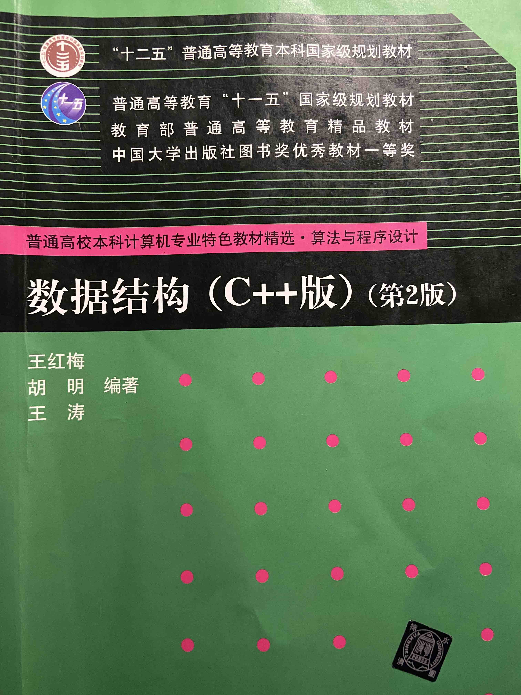

# DataStructures-Algorithm
最近在刷 leetcode ，才发现数据结构和算法这门课是多么重要，也特别悔恨上课睡的觉，所以再重新刷一遍这门课 希望能有所收获  
涉及的代码和笔记 也会放在这个repository 一是方便自己整理复习 二是希望能帮助到需要的同学 
之前做题一直是在用 Python ，但这次会全部使用 Java 语言 

## To-do
**DataStructures**

- [x] **稀疏数组 SparseArray**
- [x] **队列 Queue**
- [x] **链表 LinkedList**
    - [x] **单链表 SingleLinkedList**
    - [x] **双向链表 DoubleLinkedList**
    - [x] **单向循环链表 CircleSingleLinkedList**
    - [x] **约瑟夫问题 Josephu**
- [ ] **栈 Stack**

 
 
 

